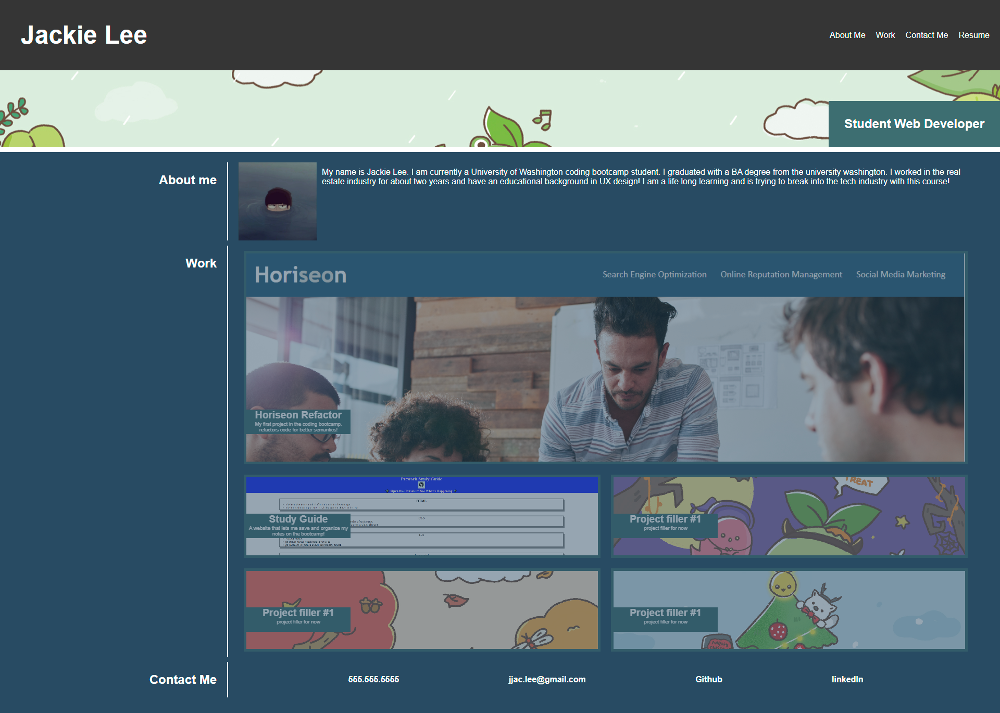
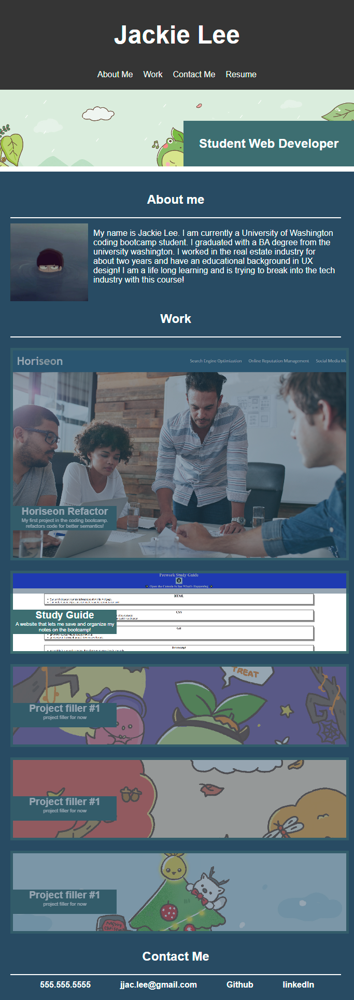

# Work Portfolio

## Description

This is my work portfolio. It will show you all the information you will know to get a gauge on my coding abilities. There is an about me section that summarizes my experiences and education. There will also be a work section that shows you all of the project that I have done. Finally, you'll find contact information to get in touch with me. 

My motivation for this project is to have space to show off my work and abilities in coding to employers when I am seeking out new oppurtunities. I built this project because I needed a website to store all my information in one single space. What I learned from buildilng this website is the use of flex boxes and css styling. I was able to create an responsive website that can adapt to different screen sizing. Also the css styling make it look pretty.

## Installation

N/A

## Usage

- open to the page
- go to the navigation
- click one of the links in the navigation
- if clicked on work you can now hover over a project to make it more visible
- if you want to see in more detail on a project you can click on the image and it will bring you to the deployed application
- if you clicked on contact me you can now see all the options you have to contact me
- If you click on one of the options to contact me it will direct you to the appropriate action

[https://jjackielee.github.io/work-portfolio](https://jjackielee.github.io/work-portfolio)

## Credits

N/A

## License

N/A

---

## Features

When you click on the link on the top it will bring you to the appropriate section of the page.
When you click on the images in the work section it will bring you to the deployed application.
When you click on the links in the contact me section it will bring you to the appropriate form of contact.

